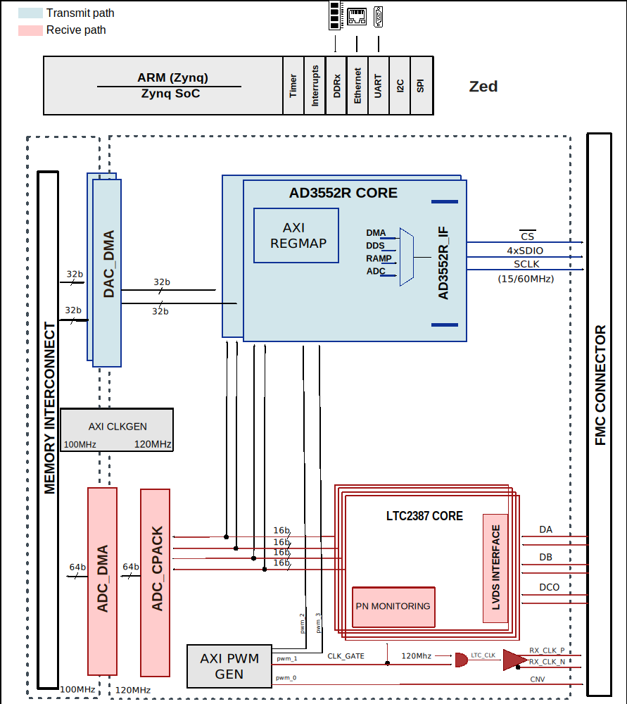

HDL Project
============

Introduction
------------

This page describes the HDL project for 
:ref:`CN0584 Precision Low Latency Development Kit <eval-cn0584-ebz>`
and :ref:`CN0585 Quad Channel, Low Latency, Data Acquisition and Signal Generation Module <eval-cn0585-fmcz>`.

Functional Overview
-------------------

The HDL reference design is an embedded system built around a processor core
either ARM, NIOS-II, or Microblaze. A functional block diagram of the system
is shown below. The device digital interface is handled by specific device
cores :git-repo:`axi_ad35552r </analogdevicesinc/hdl/tree/master/library/axi_ad3552r>`
for the DAC path and :git-repo:`axi_ltc2387 </analogdevicesinc/hdl/tree/master/library/axi_ltc2387>`
for the ADC path. The cores are programmable through an AXI-lite interface.

Digital Interface
-----------------

The digital interface consists of a Quad SPI port running at 15/60MHz depending
on the FSM state (control/stream) for the DAC path and 3 LVDS serial pairs for
the ADC path. The clock signals are generated by the AXI_PWM_GEN and AXI_CLKGEN
IP cores.

DAC Interface
-------------

The DAC data may be sourced from an internal data generator (DDS or pattern),
from the external DDR via DMA or from the ADC. The source control selection can
be made by updating the `REG_CHAN_CNTRL_7 (DAC Channel) <https://analogdevicesinc.github.io/hdl/user_guide/ip_cores/axi_dac/index.html#dac-channel>`
register.

ADC Interface
-------------

The ADC data is sent to DDR via DMA. The ADC PACK IP (util_cpack) allows the use
of a single DMA IP core for all four analog-to-digital converters.

Control and SPI
---------------

The SPI signals of the ADC are controlled by the SPI port of the ARM processor.

The DAC’s control is performed by the :git-repo:`axi_ad35552r </analogdevicesinc/hdl/tree/master/library/axi_ad3552r>`
IP core.

Download
--------

.. admonition:: Download

    The HDL repository, list of supported carriers, and the list of required IP
    cores can be found here:

    - Hardware: :adi:`EVAL-CN0585-FMCZ <cn0585>`
    - HDL Project: `hdl_cn0585 <https://github.com/analogdevicesinc/hdl/tree/cn0585_v1/projects/cn0585_fmcz>`_
    - Carriers: `zed <https://github.com/analogdevicesinc/hdl/tree/cn0585_v1/projects/cn0585_fmcz/zed>`_
    - Library Cores:

            - `axi_clkgen <http://github.com/analogdevicesinc/hdl/tree/master/library/axi_clkgen>`_
            - `axi_dmac <http://github.com/analogdevicesinc/hdl/tree/master/library/axi_dmac>`_
            - `axi_hdmi_tx <http://github.com/analogdevicesinc/hdl/tree/master/library/axi_hdmi_tx>`_
            - `axi_i2s_adi <http://github.com/analogdevicesinc/hdl/tree/master/library/axi_i2s_adi>`_
            - `axi_ltc2387 <http://github.com/analogdevicesinc/hdl/tree/master/library/axi_ltc2387>`_
            - `axi_ad3552r <http://github.com/analogdevicesinc/hdl/tree/cn0585_v1/library/axi_ad3552r>`_
            - `axi_pwm_gen <http://github.com/analogdevicesinc/hdl/tree/master/library/axi_pwm_gen>`_
            - `axi_spdif_tx <http://github.com/analogdevicesinc/hdl/tree/master/library/axi_spdif_tx>`_
            - `axi_sysid <http://github.com/analogdevicesinc/hdl/tree/master/library/axi_sysid>`_
            - `sysid_rom <http://github.com/analogdevicesinc/hdl/tree/master/library/sysid_rom>`_

Reference Demos & Software
--------------------------

- :adi:`CN0584 Precision Low Latency Development Kit <cn0584>`
- :adi:`CN0585 Quad Channel, Low Latency, Data Acquisition and Signal Generation Module <cn0585>`
- :git-hdl:`AXI_AD3552R IP core </docs/library/axi_ad35xxr/index.rst>`
- :git-hdl:`AXI_LTC2387 IP core </docs/library/axi_ltc23877/index.rst>`
- :dokuwiki:`AD3552R Dual Channel, 16-Bit, 33 MUPS, Multispan, Multi-IO SPI DAC Linux device driver <resources/tools-software/linux-drivers/iio-dac/axi-ad3552r>`
- :dokuwiki:`LTC2387 SAR ADC IIO Linux Driver <resources/tools-software/linux-drivers/iio-adc/ltc2387>`

Help & Support
----------------

The :dokuwiki:`carriers (abbreviations can be found here) </resources/fpga/docs/hdl#list_of_carriers_supported>` 
are commonly available FPGA evaluation boards.

The :git-hdl:`HDL user guide </docs/user_guide/index.rst>` contains all the documentation, build instructions and register map tables.

The following quick links allows you to browse the github repository for a list of current `branches <http://github.com/analogdevicesinc/hdl/branches/active>`_, 
`library components <http://github.com/analogdevicesinc/hdl/tree/main/library>`_, and `projects <http://github.com/analogdevicesinc/hdl/tree/main/projects>`_.

Questions? We can help with `FPGA questions <https://ez.analog.com/community/fpga>`_, 
`Linux driver questions <https://ez.analog.com/community/linux-device-drivers/linux-software-drivers>`_, or
`No-OS Drivers questions <https://ez.analog.com/community/linux-device-drivers/microcontroller-no-os-drivers>`_.
